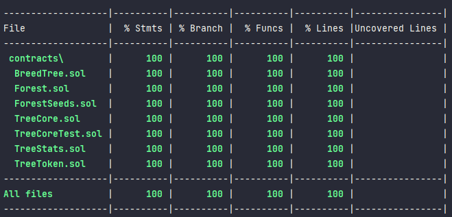

# Garden Pomodoro

A handy pomodoro app using smart contracts, where you can earn tokens to evolve your garden's NFT.

<!-- toc -->

- [Features](#features)
- [Prerequisites](#prerequisites)
- [Installation](#installation)
  * [Contract](#contract)
  * [Frontend](#frontend)
- [Run Locally](#run-locally)
  * [Contract](#contract-1)
  * [Frontend](#frontend-1)
- [Deployment on Mumbai testnet](#deployment-on-mumbai-testnet)
- [Running Tests](#running-tests)
  * [Contract](#contract-2)
  * [Frontend](#frontend-2)
- [Documentation](#documentation)
  * [Contract](#contract-3)
    + [TreeCore.sol](#treecoresol)
    + [TreeToken](#treetoken)
    + [BreedTree](#breedtree)
    + [Forest](#forest)
    + [ForestSeeds](#forestseeds)
    + [TreeStats](#treestats)

<!-- tocstop -->

## Features

- [x] Pomodoro timer
- [x] Earn tokens
- [x] Evolve your garden
- [x] Marketplace
- [x] Mint your own seed
- [x] Breed your seeds to create new ones

## Prerequisites

- [Node.js](https://nodejs.org/en/) (v18.0.0 or later)
- [Pnpm](https://pnpm.io/) (v7.18.0 or later)
- [Docker](https://www.docker.com/) (v20.10.8 or later) if you plan to build the frontend image
- [Metamask](https://metamask.io/) account (Mumbai testnet)
- [Alchemy](https://www.alchemy.com/) API key (Mumbai testnet)

## Installation

### Contract

To compile the contract, run :

```bash
pnpm install
pnpm run compile

```

### Frontend

To build the frontend, run :

```bash
cd frontend
pnpm install
pnpm run build
```

## Run Locally

Clone the project

```bash
  git clone https://github.com/jardin-pomodoro/react-pomodoro.git
```

Go to the project directory

```bash
  cd react-pomodoro
```

Copy the `.env.example` file to `.env` and fill it with your Alchemy API key and
your [Metamask owner private key](https://metamask.zendesk.com/hc/en-us/articles/360015289632-How-to-export-an-account-s-private-key) (
it will not be used for local deployment but deploy script require it anyway).

```bash
  cp .env.example .env
```

### Contract

Install dependencies and compile the contract

```bash
  pnpm install
  pnpm run compile
```

Start a hardhat node

```bash
  pnpm run local-node
```

Deploy the contract in another terminal

```bash
  pnpm run deploy:local
```

### Frontend

Install dependencies

```bash
cd frontend
pnpm install

```

Start the frontend

```bash
pnpm run dev

```

You can access the frontend at http://localhost:5173/

## Deployment on Mumbai testnet

Follow the same instructions as for local deployment but replace `local` by `mumbai` in the commands.

```bash
git clone https://github.com/jardin-pomodoro/react-pomodoro.git
cd react-pomodoro
cp .env.example .env

```

Fill it with your Alchemy API key and
your [Metamask owner private key](https://metamask.zendesk.com/hc/en-us/articles/360015289632-How-to-export-an-account-s-private-key)

```bash 
pnpm install
pnpm run compile
pnpm run deploy:mumbai

```

You can run the frontend the same way as for local deployment.

```bash
cd frontend
pnpm install
pnpm run dev

```

## Running Tests

### Contract

To run tests locally on the contract, run :

```bash
pnpm install
pnpm run test

```

It will run the tests on a hardhat local node.

If you want to see the test coverage, just run this command instead of `test` :

```bash
pnpm run coverage

```



### Frontend

To run tests locally on the frontend, run :

```bash
cd frontend
pnpm install
pnpm run test

```

## Documentation

### Contract

#### TreeCore.sol

It is the contract that will be deployed on the blockchain.

This contract is a combination of several contracts that provide functionality for creating and managing virtual trees.

These contracts include:

- `TreeToken`: Provides functionality for creating and managing ERC-1155 tokens
- `BreedTree`: Provides functionality for breeding two trees to create a new tree
- `Forest`: Manages the planting and collection of trees
- `TreeStats`: Provides functionality for upgrading the trunk and leaves of a tree
- `ForestSeeds`: Manages the seeds needed to plant and grow a tree

The `TreeCore` contract includes several events that are triggered at various points in the tree creation and management
process:

- `TreeMinted`: Triggered when a new tree is minted
- `TreePlanted`: Triggered when a tree is planted
- `TreeCollected`: Triggered when a tree is collected

The contract also includes several functions for creating and managing trees:

- `createTree(uint childSeed)`: Creates a new tree with the given seed
- `breedTree(uint256 _tokenId1, uint256 _tokenId2)`: Breeds two trees to create a new tree
- `plantTree(uint256 _tokenId)`: Plants a tree
- `collectTree()`: Collects a tree that is ready to be collected
- `upgradeTreeTrunk(uint256 _tokenId)`: Upgrades the trunk of a tree
- `upgradeTreeLeaves(uint256 _tokenId)`: Upgrades the leaves of a tree

The contract also includes several pure functions for getting information about seeds:

- `getSeedLeavesStats(uint _seed)`: Returns the leaves stats for a seed
- `getSeedTrunkStats(uint _seed)`: Returns the trunk stats for a seed
- `getTreeRarity(uint _seed)`: Returns the rarity of a tree based on its seed

The `TreeCore` contract also includes functions for interacting with the `TreeToken` contract:

- `mintTree(address owner, uint childSeed)`: Mints a new tree for the given owner with the given seed
- `balanceOf(address owner, uint256 _tokenId)`: Returns the balance of trees for the given owner with the given token ID

The `TreeCore` contract also includes functions for interacting with the `BreedTree` contract:

- `canTreeBreed(uint256 _tokenId)`: Verifies that a tree can be bred
- `breedTrees(uint256 _tokenId1, uint256 _tokenId2, uint seed1, uint seed2)`: Breeds two trees to create a new tree

The `TreeCore` contract also includes functions for interacting with the `Forest` contract:

- `updateSeeds(uint256 _tokenId)`: Updates the number of seeds available for a tree
- `consumeSeed(uint256 _tokenId)`: Consumes a seed for a tree
- `plantTree(uint256 _tokenId, uint trunkUpgrade)`: Plants a tree with the given trunk upgrade
- `collectTree(uint leavesUpgrade)`: Collects a tree with the given leaves upgrade

The `TreeCore` contract also includes functions for interacting with the `TreeStats` contract:

- `addTreeStats(uint256 _tokenId, uint rarity)`: Adds tree stats for the given tree with the given rarity
- `getTreeStats(uint256 _tokenId)`: Returns the stats for the given tree
- `canUpgradeTrunk(uint256 _tokenId)`: Verifies that the trunk of a tree can be upgraded
- `upgradeTrunk(uint256 _tokenId)`: Upgrades the trunk of a tree
- `canUpgradeLeaves(uint256 _tokenId)`: Verifies that the leaves of a tree can be upgraded
- `upgradeLeaves(uint256 _tokenId)`: Upgrades the leaves of a tree

The `TreeCore` contract also includes functions for interacting with the `ForestSeeds` contract:

- `getSeed(uint256 _tokenId)`: Returns the seed for the given tree
- `getSeeds(uint256 _tokenId)`: Returns the number of seeds available for the given tree
- `getGrowingTree()`: Returns the tree that is currently growing

Overall, the `TreeCore` contract provides a comprehensive set of functions for creating, breeding, planting, and
upgrading virtual trees. It combines the functionality of several other contracts to provide a complete solution for
managing virtual trees.

#### TreeToken

This contract is an implementation of the **ERC-1155** standard for creating and managing a collection of virtual trees.
It
is built on top of the `ERC1155Supply` contract and includes the `Ownable` contract for adding ownership functionality.
It
also includes the `Strings` contract for working with string data.

The contract includes several public variables:

- `name`: The name of the tree collection
- `CONTRACT_OWNER`: The owner of the contract
- `TREE_TOKEN`: The identifier for the tree token

It also includes a `mapping` to store the seeds for each tree.

The contract includes a constructor that sets the **URI** for the tree collection and initializes the `ERC1155Supply`
contract.

The contract includes several functions for creating and managing trees:

- `mintTree(address _to, uint _seed)`: Mints a new tree for the given owner with the given seed
- `setURI(string newUri)`: Sets the **URI** for the tree collection (only callable by the owner)

The contract also includes functions for interacting with the `ERC1155Supply` contract:

- `withdraw()`: Allows the owner to withdraw any funds that have been sent to the contract
- `uri(uint256 _tokenId)`: Returns the **URI** for the given tree
- `baseTokenURI()`: Returns the base **URI** for the tree collection

The contract also includes several utility functions:

- `getSeed(uint256 _tokenId)`: Returns the seed for the given tree
- `getTokenCount()`: Returns the total number of trees in the collection

Overall, the `TreeToken` contract provides a basic implementation of the **ERC-1155** standard for creating and managing
a collection of virtual trees. It allows for the creation and minting of new trees and provides a way to retrieve the
seed for a given tree. It also includes functions for setting the **URI** for the tree collection and withdrawing any
funds sent to the contract.

#### BreedTree

This contract provides functionality for breeding two trees to create a new tree. It includes a mapping to store the
number of times each tree has been bred.

The contract includes several private functions for breeding trees:

- `mutate(uint seed)`: Mutates a seed to create a new seed
- `breed(uint seed1, uint seed2)`: Breeds two seeds to create a new seed
- `breedTrees(uint256 _tokenId1, uint256 _tokenId2, uint seed1, uint seed2)`: Breeds two trees to create a new tree

It also includes a function for verifying that a tree can be bred:

- `canTreeBreed(uint256 _tokenId)`: Verifies that a tree can be bred

The contract also includes a public function for calculating the cost of breeding two trees:

- `treeBreedCost(uint treeRarity1, uint treeRarity2)`: Returns the cost of breeding two trees with the given rarities

Finally, the contract includes a public function for retrieving the number of times a tree has been bred:

- `breedCount(uint _tokenId)`: Returns the number of times the given tree has been bred

Overall, the `BreedTree` contract provides a set of functions for breeding two trees to create a new tree. It includes
mechanisms for mutating and breeding seeds, as well as tracking the number of times a tree has been bred. It also
provides a way to calculate the cost of breeding two trees.

#### Forest

This contract provides functionality for planting and collecting virtual trees. It includes a struct to store
information about planted trees, including the token ID, start time, and growing time.

The contract includes several public functions for interacting with planted trees:

- `getGrowingTime(uint256 _trunkStat)`: Returns the growing time for a tree with the given trunk stat
- `getProducedTokens(uint256 _leavesStat)`: Returns the number of tokens produced by a tree with the given leaves stat
- `getGrowingTree()`: Returns the tree that is currently growing for the caller

It also includes internal functions for planting and collecting trees:

- `plantTree(uint256 _tokenId, uint256 _trunkStat)`: Plants a tree with the given trunk stat
- `collectTree(uint _leavesStat)`: Collects a tree with the given leaves stat

Overall, the `Forest` contract provides a set of functions for planting and collecting virtual trees. It includes
mechanisms for calculating the growing time and number of tokens produced by a tree based on its trunk and leaves stats.
It also allows users to retrieve information about the tree currently growing for them.

#### ForestSeeds

This contract allows users to manage the seeds they own, including refreshing the seeds they have available to use and
purchasing additional seeds.

The contract includes a `ForestSeed` struct that stores information about a user's seeds, including the number of seeds
they have available to use, the number of seeds they have purchased, and the time of their last seed update.

The contract includes a `mapping` to store information about each user's seeds, keyed by the token ID.

The contract includes an event for tracking seed updates:

- `event SeedRefreshed(address indexed to, uint256 _tokenId, uint256 _seedCount)` : Emitted when a user's seeds are
  refreshed

The contract includes several privates functions for managing seeds:

- `registerSeeds(uint256 _tokenId)`: Initializes a user's seed information with 4 seeds and the current block timestamp.
- `consumeSeed(uint256 _tokenId)`: Decreases the number of seeds a user has available to use by 1. If the user has no
  seeds available, it decreases their number of purchased seeds by 1.
- `addSeeds(uint256 _tokenId, uint256 amount)`: This function is called when a player purchases seeds and increments
  the `boughtSeeds` field by the specified amount.

The contract also includes several public functions for managing seeds:

- `updateSeeds(uint256 _tokenId)`: Refreshes a user's seeds if it has been more than one day since their last update. It
  sets their seeds to 4 and updates their last update timestamp. It also emits the `SeedRefreshed` event.
- `getSeeds(uint256 _tokenId)`:  Returns the total number of seeds that a player has for a specific tree by adding
  the `seeds` and `boughtSeeds` fields.
- `getSeedCost(uint256 _tokenId)`: Returns the cost for a player to purchase an additional seed for a specific tree. The
  cost is calculated as 2 * (the number of seeds the player has already purchased + 1).

Overall, the `ForestSeeds` contract provides a set of functions for managing seeds. It allows users to refresh the seeds
they have available to use and purchase additional seeds. It also tracks the number of seeds a user has purchased.

#### TreeStats

This contract provides functionality for upgrading the stats of virtual trees. It includes a struct to store information
about tree upgrades, including the maximum number of upgrades, the number of leaves upgrades, and the number of trunk
upgrades.

The contract includes several public functions for interacting with tree upgrades:

- `getLeavesUpgradeCost(uint256 _tokenId, uint leavesBaseStates)`: Returns the cost of upgrading the leaves of a tree
  with the given token ID and base leaves stats
- `getTrunkUpgradeCost(uint256 _tokenId, uint trunkBaseStats)`: Returns the cost of upgrading the trunk of a tree with
  the given token ID and base trunk stats
- `getTreeStats(uint256 _tokenId)`: Returns the stats of a tree with the given token ID

It also includes internal functions for upgrading trees:

- `canUpgradeTrunk(uint256 _tokenId)`: Verifies that the trunk of a tree with the given token ID can be upgraded
- `canUpgradeLeaves(uint256 _tokenId)`: Verifies that the leaves of a tree with the given token ID can be upgraded
- `upgradeTrunk(uint256 _tokenId)`: Upgrades the trunk of a tree with the given token ID
- `upgradeLeaves(uint256 _tokenId)`: Upgrades the leaves of a tree with the given token ID

The contract also includes an event for logging tree upgrades:

- `TreeUpgraded(address indexed to, uint256 indexed _tokenId, TreeUpgrade stats)`: Triggered when a tree is upgraded

Overall, the `TreeStats` contract provides a set of functions for upgrading the stats of virtual trees. It includes
mechanisms for calculating the cost of upgrading tree trunks and leaves, and allows users to retrieve information about
the upgrades applied to a tree. It also includes an event for logging tree upgrades.